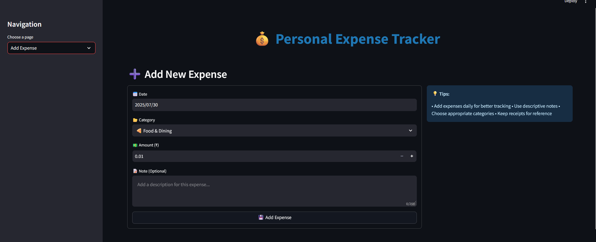
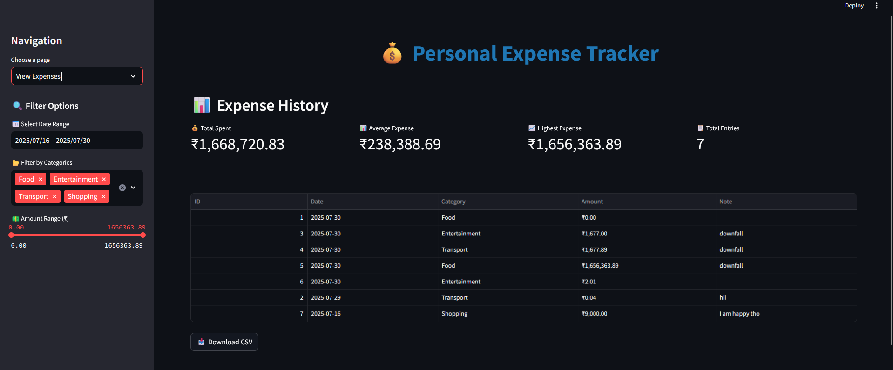
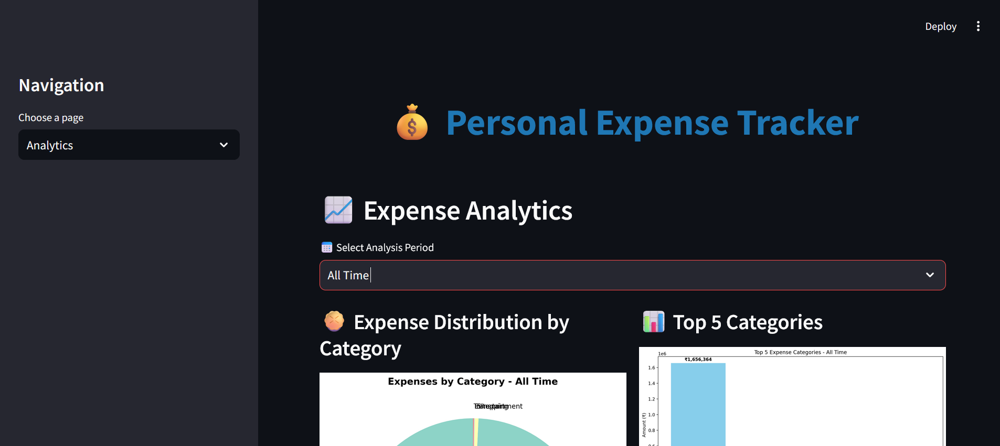
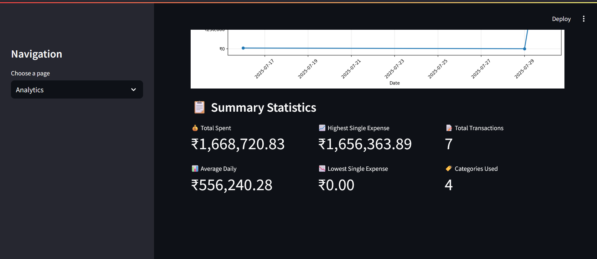

# 💰 Personal Expense Tracker Dashboard

A **Streamlit-powered web application** for tracking personal expenses, analyzing spending trends, and visualizing data with interactive charts.  

---

## 🚀 Features

- **Add, View, and Delete Expenses** with ease.
- **Powerful Filters** – Filter expenses by date range, category, and amount.
- **Interactive Analytics Dashboard** – View pie charts, bar charts, and daily spending trends.
- **Download as CSV** – Export your expenses for backup or further analysis.
- **Responsive UI** with custom CSS and emoji-enhanced categories.

---

## 🖼️ Screenshots

### **1. Add Expense**

### **2. View Expenses**

### **3. Analytics Dashboard**

---

## 🛠️ Tech Stack

- **Frontend & Dashboard:** [Streamlit](https://streamlit.io/)
- **Database:** SQLite
- **Data Handling:** Pandas
- **Visualization:** Matplotlib, Seaborn
- **Language:** Python 3.10+

---

## ✨ Future Enhancements
- Add **user authentication** (multi-user support).
- **Dark mode UI** for better aesthetics.
- Generate **monthly PDF reports** with charts.
- AI-based **spending insights**.

---

